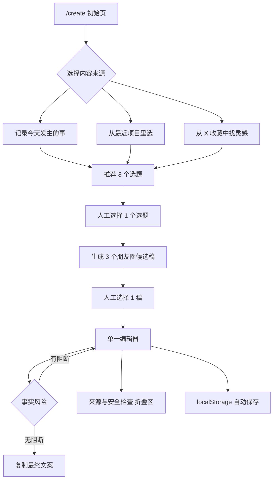

# 极简内容创作台 `/create` 产品线框与交互方案

日期：2026-07-14
状态：待齐鑫确认，design only
范围：只设计页面与交互，不写代码、不增加数据模型、不导入真实资料、不进入 Phase 6B

## 1. 产品决策

当前问题不是 Content OS 缺少能力，而是能力被 Project、SourceItem、EventCard、ContentAngle、EditorialDraft、Revision、PublicationPackage 等工程概念分散，用户无法从“我今天想发一条朋友圈”直接开始。

`/create` 是日常使用的主要入口，后续可作为登录后的默认首页。它把已有后端能力压缩为一条可理解的主线：

```text
选择来源 → 选择选题 → 选择候选稿 → 人工编辑 → 风险确认 → 复制
```

产品记忆点是“一张逐步展开的稿纸”，不是后台、数据看板或流程配置器。

### 入口层级

普通用户主流程只进入 `/create`。以下页面保留给高级操作、审核或开发排查，不放进日常创作主线：

- `/publication`：人工发布包与导出记录。
- `/editorial`：Revision、审批和声音样本沉淀。
- `/topics`：外部研究选题审核。
- `/sources/obsidian`：X 长文收藏研究库扫描与安全状态。

高级页面可以从“更多”或开发入口访问，但不得与 `/create` 的主操作并列成首页导航宫格。

### 成功标准

1. 用户第一次打开页面，首先看到“今天想写点什么？”和三个可理解入口。
2. 第一次使用者能在 3 分钟内完成一句输入、选题、选稿、修改和复制。
3. 页面同时只出现一个主操作，不要求理解数据库实体。
4. 最终文案始终经过人工编辑，系统不自动覆盖。
5. 事实风险可见但不淹没创作，技术追溯默认收起。
6. 透明工地不作为默认内容，只能由用户主动打开“查看流程演示”。

### 本阶段不做

- 不增加 Prisma 模型或 migration。
- 不增加扫描器、后台任务、队列、缓存或 AI Provider。
- 不批量导入 164 篇 X 收藏资料或 30 条 TopicCandidate。
- 不自动批准、不创建自动发布链路、不调用平台 API。
- 不把 `/create` 做成现有后台页面的导航集合。
- 不重做 `/editorial`、`/opportunities`、`/topics` 或 `/publication`。

## 2. 用户心智

页面只使用用户语言：

| 工程概念 | `/create` 中的用户语言 |
|---|---|
| Project / EventCard / SourceItem | 最近项目 / 这次发生的事 / 来源 |
| TopicCandidate / ContentAngle | 选题 |
| MasterContent / EditorialDraft | 候选稿 |
| human_edit Revision | 当前编辑稿 |
| StyleReview / factBoundary | 风险提示 |
| evidenceSnapshot / hash | 来源与安全检查 |
| PublicationPackage / Export | 不在主流程出现 |

页面不显示“模型已生成”“创建 Revision”“写入数据库”等实现语言。

## 3. 视觉方向

方向：**克制的单页编辑桌**。

- 白色页面、深灰正文，使用低饱和绿色表示完成，琥珀色表示需要确认，红色只用于阻断风险。
- 不使用渐变、装饰图形、营销式 Hero、悬浮大卡片或卡片套卡片。
- 主体最大宽度约 920px，编辑区保持适合中文长文阅读的 640–720px 行宽。
- 使用细分隔线建立节奏；容器圆角不超过 4px。
- 标题克制，主标题 28–32px；编辑器正文 16px、行高 1.8。
- 顶部步骤只表达位置，不显示后台完成百分比或复杂状态。
- 桌面与移动端均保持单列，不在窄屏强行做三栏。

## 4. 页面信息架构



页面由五个连续区段组成：

1. 来源
2. 选题
3. 候选稿
4. 编辑
5. 来源与安全检查

未到达的区段不渲染占位大框；已完成区段收成一行摘要，可点击返回修改。

### 完整页面结构

1. 极简页头：产品名、“今天想写点什么？”和“清空本次创作”。
2. 三个来源入口：记录今天发生的事、从最近项目里选、从 X 收藏中找灵感。
3. 当前来源区：自然语言输入、最近项目列表或 X 收藏真实空状态。
4. 三个选题：单选卡片和“生成 3 个版本”。
5. 三个候选稿：真实记录版、个人观点版、克制短版。
6. 单一大编辑器：轻量提示、配图建议和本地保存状态。
7. 最终操作：复制文案；复制并清空、返回修改为次要操作。
8. “来源与安全检查”折叠区。

## 5. 桌面线框

```text
┌────────────────────────────────────────────────────────────────────┐
│ 齐鑫 Content OS                           [清空本次创作] [更多 ···]│
│                                                                    │
│ 今天想写点什么？                                                   │
│ 来源 ───── 选题 ───── 草稿 ───── 编辑                              │
├────────────────────────────────────────────────────────────────────┤
│ 请选择一个开始方式                                                  │
│                                                                    │
│ [笔] A. 记录今天发生的事                                           │
│     输入一句话、项目变化或最近的想法。                             │
│ ────────────────────────────────────────────────────────────────── │
│ [夹] B. 从最近项目里选                                             │
│     从真实项目进展中寻找值得记录的内容。                           │
│ ────────────────────────────────────────────────────────────────── │
│ [签] C. 从 X 收藏中找灵感                                          │
│     从收藏长文中提取观点，但必须加入自己的经历和判断。             │
│                                                                    │
│ ┌────────────────────────────────────────────────────────────────┐ │
│ │ 今天透明工地又改了一版                                        │ │
│ └────────────────────────────────────────────────────────────────┘ │
│                                                                    │
│                                               [推荐选题 →]          │
│ 查看流程演示                                                        │
├────────────────────────────────────────────────────────────────────┤
│ 2 选一个值得写的方向                                                │
│                                                                    │
│ ◉ 又改了一版，真正变化的是什么？                                   │
│   值得写：过程里出现了新的判断                                     │
│   切入：先说变化，再说自己怎么看 · 朋友圈 · 还缺最终结果           │
│ ────────────────────────────────────────────────────────────────── │
│ ○ 为什么“改完”不等于“做完”？                                     │
│   值得写：保留没做完的真实状态                                     │
│   切入：从一次误判开始 · 朋友圈 · 真实信息基本完整                 │
│ ────────────────────────────────────────────────────────────────── │
│ ○ 今天这次修改让我确认了一件事                                     │
│   值得写：个人判断来自具体经历                                     │
│   切入：事情在前，观点在后 · 朋友圈 / X · 还缺具体细节             │
│                                                                    │
│                                           [生成 3 个候选稿 →]        │
├────────────────────────────────────────────────────────────────────┤
│ 3 先挑一版接近你的                                                  │
│                                                                    │
│ [真实记录版]   [个人观点版]   [克制短版]                            │
│ ────────────────────────────────────────────────────────────────── │
│ 最近……                                                             │
│                                                                    │
│ （当前候选全文，只读预览）                                         │
│ 差异：先记录今天发生的事，不急着下结论。                           │
│                                                                    │
│                                                [选择此版本 →]       │
├────────────────────────────────────────────────────────────────────┤
│ 4 改成你真正会发的样子                                              │
│                                                                    │
│ ┌────────────────────────────────────────────────────────────────┐ │
│ │ 单一正文编辑器                                                 │ │
│ │                                                                │ │
│ │                                                                │ │
│ └────────────────────────────────────────────────────────────────┘ │
│                                                                    │
│ 已自动保存在本机                                                   │
│ ⚠ 这一段有点像项目报告 · 这里的结论比较绝对                       │
│ 配图建议：真实修改界面；注意隐藏客户信息                           │
│                                                                    │
│ ▸ 来源与安全检查                                                   │
│                                                                    │
│ [返回修改] [复制并清空]                         [复制文案]          │
└────────────────────────────────────────────────────────────────────┘
```

说明：线框中的项目和选题是布局示例，不代表当前数据库一定存在。真实实现必须读取现有数据；没有数据时显示空状态，不生成假项目。

## 6. 移动端线框

```text
┌────────────────────────────┐
│ 今天想写点什么？    [清空] │
│ 来源 · 选题 · 草稿 · 编辑  │
├────────────────────────────┤
│ [笔] 记录今天发生的事       │
│ 输入一句话或最近的想法。    │
│                            │
│ [夹] 从最近项目里选         │
│ 从真实项目进展中找内容。    │
│                            │
│ [签] 从 X 收藏中找灵感      │
│ 加入自己的经历和判断。      │
│                            │
│ [自然语言输入框]           │
│          [推荐选题 →]      │
├────────────────────────────┤
│ 后续步骤按选择逐段出现      │
│ 候选稿使用横向标签切换      │
│ 编辑器占满可用宽度          │
├────────────────────────────┤
│ 已自动保存在本机           │
│ ⚠ 2 条轻量提示             │
│ 配图建议：真实界面         │
│ ▸ 来源与安全检查           │
│                            │
│ [复制文案]                 │
│ 返回修改 · 复制并清空      │
└────────────────────────────┘
```

移动端底部主按钮可以保持在安全区上方，但不能遮挡正文、风险提示或折叠区。

## 7. 交互规则

### 7.1 初始状态

- 页面标题固定为“今天想写点什么？”。
- 首屏按顺序显示三个入口，每个入口使用图标、标题和一句说明：
  - A. 记录今天发生的事：输入一句话、项目变化或最近的想法。
  - B. 从最近项目里选：从真实项目进展中寻找值得记录的内容。
  - C. 从 X 收藏中找灵感：从收藏长文中提取观点，但必须加入自己的经历和判断。
- 默认不预选入口，也不自动推荐透明工地。
- 入口使用三行大按钮，不使用后台导航卡片或工程实体名称。
- 只显示来源区和一个禁用的“推荐选题”按钮；选择入口后在原位置展开对应输入。
- 页面不显示历史 Draft、发布包、分数或数据库数量。

### 7.2 入口 A：记录今天发生的事

手动输入只提供一个自然语言输入框，不要求用户先理解或填写项目、SourceItem、EventCard、标签、事实等级或平台参数。

输入示例：

- 今天透明工地又改了一版
- 最近用 Codex 做了一个内容系统
- 我发现 AI 让会思考的人差距更大了
- 今天去西湖等台风，结果好像什么也没发生

占位文案：

```text
写下一句话、一个变化，或者最近冒出来的想法。
```

系统在后台从自然语言中判断事件、观点、结果、感受和缺失信息。信息不完整时仍可推荐选题，但选题卡必须显示“还缺什么真实信息”，不能弹出 EventCard 表单阻断用户。

用户选择选题后，缺少的结果、细节或依据继续作为轻量事实提示；系统不得自动补造。

### 7.3 入口 B：从最近项目里选

显示最近有真实 EventCard 或可追溯 SourceItem 的项目，最多 5 个：

- 项目名
- 最近一次可用事件的日期
- 一句发生了什么

不显示项目 ID、事件状态、素材数量和评分。

排序：按最近一次可用真实事件时间倒序。若项目只有计划、没有可核验事件，不进入默认列表。

“透明工地资料整理”不出现在最近项目默认列表。它只能通过独立的“查看流程演示”入口加载，并始终显示：

```text
演示案例，不代表当前推荐发布内容。
```

### 7.4 入口 C：从 X 收藏中找灵感

正式定位固定为：

> X 长文收藏研究库——以 X 收藏长文为主、持续更新的动态外部研究资料源。

只显示经过人工 shortlist、来源未隔离且仍有效的 TopicCandidate。每条只显示标题、核心角度和来源数量，不显示 evidenceStrength 分数。

当前真实 TopicCandidate 为 0，首版应显示真实空状态：

```text
X 收藏尚未正式导入。
导入并完成人工筛选后，灵感会出现在这里。
```

空状态不展示示例选题、私有 manifest 预览或虚假数量。不读取仓库外私有 manifest 伪装成正式数据，不自动导入 30 条候选，不提供“立即扫描”或“批量导入”入口。

外部资料只提供研究角度，不得直接作为齐鑫的个人经历或已验证事实。选中后如缺少齐鑫的一手经历，系统应先要求补一句“这和我有什么关系”，再允许生成候选稿。

### 7.5 推荐 3 个选题

推荐结果固定为 3 张克制的单选卡片。每张只显示：

- 选题标题。
- 为什么值得写。
- 推荐切入角度。
- 适合的平台。
- 是否还缺真实信息。

不显示 ID、hash、数据库模型、evidenceStrength 数字、StyleReview 分数、五项 ContentScore、总分、recommendation 枚举或模型推理过程。

推荐必须来自现有 ContentAngle / TopicCandidate / EventCard 事实，不补充新成果。少于 3 个可信角度时，宁可显示 1–2 条并说明“当前资料只支持这些角度”，不能用空话凑满。

更换来源时，如果已生成下游内容，先确认：

```text
更换来源会清空当前选题和草稿。
```

确认后只清理本页下游状态，不删除已有数据库记录。

### 7.6 生成 3 个朋友圈候选稿

三稿固定围绕同一事实边界，但表达入口不同：

- A 真实记录版：先说具体发生了什么，保留没做完和不确定。
- B 个人观点版：从这件事自然带出齐鑫自己的判断。
- C 克制短版：删掉不必要解释，只保留事实、感受和一句判断。

不固定生成“项目复盘版”。只有素材确实适合复盘时，某一版才可以采用复盘结构。候选稿通过标签切换，同一时间只显示一稿全文，避免三栏比较造成阅读负担。

每版只显示：

- 完整文案。
- 一句话说明它和另外两版的差异。
- “选择此版本”按钮。

不展示复杂评分、排名或“最佳版本”标签。

候选稿是建议，不覆盖现有 MasterContent 或人工 Revision。只有用户点击“用这版继续”后，所选文本才进入单一编辑器。A/B/C 和当前编辑文本保存在浏览器会话状态中，不持久化为新模型，也不暗中创建 Revision。

生成中保留页面结构，显示行内进度“正在整理 3 个版本…”，不使用全屏 loading。

### 7.7 单一编辑器

选择一版后进入单一大编辑器。页面只保留文案编辑框、轻量提示、配图建议和复制操作，不分别编辑 Hook、body、CTA，也不展示内部标题。

编辑器规则：

- 选择候选稿后自动聚焦正文，但不写数据库、不批准。
- 用户输入后，系统建议不得直接改写正文。
- 切换回候选稿时，如已有人工修改，必须确认是否放弃当前编辑。
- Hook 和 CTA 允许为空，不显示必填提示。
- 复制内容仅包含当前编辑器正文，不包含内部标题、风险、来源或检查项。
- 候选稿进入编辑器时，Hook、body、CTA 按空行组合为一篇连续文本；首版不反向猜测分段。
- 页面使用 localStorage 自动保存当前来源、自然语言输入、选题、候选、人工文本和所在步骤。
- 保存成功后在编辑器下方显示“已自动保存在本机”。
- 页面刷新、关闭后重新打开或浏览器重启后，均恢复最近一次未清空的创作。
- 本地草稿不与账号同步，不声称云端备份；不同浏览器和设备互不可见。
- 提供“清空本次创作”，执行前二次确认，确认后删除对应 localStorage 草稿并回到首屏。
- “复制最终文案”只写剪贴板，不创建 Draft、Revision、VoiceSample、PublicationPackage 或 Export。

首版不提供富文本工具栏、Emoji 选择器、自动配图或平台切换。配图建议只说明需要什么真实图片及隐私注意事项，不声称图片已经生成或存在。

### 7.8 少量事实风险提示

主界面最多显示 3 条高价值提示，使用短句，例如：

- “这句话还没有证据”
- “这一段有点像项目报告”
- “这里的结论比较绝对”
- “图片可能包含客户隐私”

风险分两级：

| 级别 | 行为 |
|---|---|
| 阻断 | 未证实成果、把计划写成完成、把外部观点写成本人经历；复制按钮禁用，定位到对应句子 |
| 提醒 | 表达绝对、来源较旧、个人判断缺少限定；允许复制，但保留提示 |

不在主界面显示 overallScore、authenticityScore、aiToneScore 或完整 StyleReview。风险消除后提示行变成“未发现明显事实风险”，不使用庆祝动画。

提示只能指出位置、原因和人工建议，不得自动改写、替换或接受正文。

### 7.9 最终操作

主要操作只有：

- 复制文案

次要操作：

- 复制并清空：先复制当前正文，再二次确认并清除本机草稿。
- 返回修改：回到选题或候选稿步骤，保留当前编辑，直到用户确认替换。
- 查看来源与安全检查：展开只读检查区，不离开 `/create`。

复制成功提示固定为“已复制，未自动发布”。复制操作不更新任何发布状态。

## 8. “来源与安全检查”折叠区

默认收起。普通用户展开后只看到四组用户语言信息：

1. 来源摘要：项目变化、手动输入或 X 收藏文章的必要摘要。
2. 未确认事实：当前缺少结果、数字、时间或一手经历的位置。
3. 隐私风险：客户姓名、电话、地址、聊天记录、账号或水印。
4. 配图注意事项：建议使用的真实图片和必须遮挡的信息。

不显示完整 StyleReview、评分、检查单、数据库模型、SourceItem ID、EventCard ID、Revision ID、evidenceSnapshot、hash、packageHash 或 PublicationExport。

只有显式开启开发调试模式后，才允许出现独立的“开发调试信息”区域。调试模式默认关闭，不由普通用户误触；即使开启也不得显示绝对路径、密钥、Cookie 或完整私人来源正文。

## 9. 现有后端能力映射

本设计不要求新增基础设施：

| 页面动作 | 优先复用能力 | 设计约束 |
|---|---|---|
| 最近项目 | Project、EventCard、SourceItem 查询 | 只选有真实事件和来源的项目 |
| 手动输入 | 自然语言输入 + 现有 fact-check / 内容角度能力 | 后台判断缺失信息，不要求用户填工程字段 |
| X 长文收藏 | 已人工筛选的外部研究摘要 | 当前尚未正式导入，显示真实空状态 |
| 3 个选题 | ContentAngle、ContentScore、后续可用的 TopicCandidate | 只显示用户可读的五项卡片信息 |
| 3 个候选稿 | content generator、VoiceProfile、7 条 VoiceSample | 只生成朋友圈；不复制样本原句 |
| 人工编辑 | localStorage 本地草稿；现有 EditorialDraft 仅可作为输入 | 首版不暗中创建 Revision，不覆盖已有人工稿 |
| 风险提示 | fact-check、StyleReview、factBoundary | 主界面最多 3 条，其余折叠 |
| 复制 | 当前编辑器文本和浏览器 Clipboard API | 不写数据库，不要求 PublicationPackage/Export |

### 关键实现边界

1. `/create` 是现有能力的编排层，不是新的内容实体。
2. 候选 A/B/C 和当前人工编辑稿由 localStorage 保存；首版复制流程不进入 Draft/Revision。
3. 复制不是发布，不更新 PublicationPackage 为 published。
4. localStorage 是 MVP 本地草稿机制，不与账号同步，不生成 Revision、VoiceSample 或 PublicationPackage。
5. 如现有服务无法在不修改模型的前提下完成某一步，应先回到产品确认，不以新增表解决交互问题。

## 10. 页面状态与错误处理

| 状态 | 页面反馈 | 下一步 |
|---|---|---|
| 有本机草稿 | 首屏显示“发现一篇未完成的创作” | 继续编辑 / 清空重来 |
| 无最近项目 | “还没有可用于创作的真实项目记录” | 切换手动输入 |
| X 收藏为空 | “X 收藏尚未正式导入” | 切换其他入口 |
| 正在推荐选题 | 保留输入，显示三行稳定骨架和“正在找值得写的方向…” | 等待结果 |
| 手动输入信息不足 | 仍显示可支持的选题，在卡片标记“还缺真实信息” | 继续选择或补充输入 |
| 选题不足 3 个 | 显示现有可信选题，不补空话 | 选择其中一个或换来源 |
| 选题推荐失败 | 保留来源，“暂时没找到合适选题，请重试” | 重试推荐 |
| 正在生成三稿 | 保留选题和标签宽度，“正在整理 3 个版本…” | 等待结果 |
| 候选稿生成失败 | 保留来源和选题，“候选稿生成失败，请重试” | 重试生成 |
| 有阻断风险 | 高亮对应句子，复制禁用 | 人工修改 |
| 复制成功 | “已复制，未自动发布” | 用户自行发布 |
| localStorage 写入失败 | “无法自动保存，请先复制当前文案” | 保留当前内存文本并复制 |
| 用户返回上一步 | 保留当前编辑；若选择新选题或候选，确认是否替换 | 确认或取消 |
| 页面刷新 | 从 localStorage 恢复来源、步骤和人工文本 | 继续当前步骤 |
| 清空本次创作 | 二次确认“清空后无法恢复” | 确认后回到首屏 |

错误信息不得输出模型栈、数据库错误、绝对路径或 SourceItem ID。

### 返回上一步行为

- 编辑 → 候选稿：保留当前编辑，不立即替换。
- 候选稿 → 选题：保留已生成三稿；选中新选题后才确认清空三稿和编辑。
- 选题 → 来源：保留当前来源输入；选择新来源后才确认清空下游内容。
- 浏览器后退或刷新：优先恢复 localStorage，不因路由动作静默丢稿。

## 11. 主界面文案

建议固定文案：

| 位置 | 文案 |
|---|---|
| 页面标题 | 今天想写点什么？ |
| 入口 A | 记录今天发生的事 |
| 入口 A 说明 | 输入一句话、项目变化或最近的想法。 |
| 入口 B | 从最近项目里选 |
| 入口 B 说明 | 从真实项目进展中寻找值得记录的内容。 |
| 入口 C | 从 X 收藏中找灵感 |
| 入口 C 说明 | 从收藏长文中提取观点，但必须加入自己的经历和判断。 |
| 选题标题 | 选一个值得写的方向 |
| 候选标题 | 先挑一版接近你的 |
| 编辑标题 | 改成你真正会发的样子 |
| 生成按钮 | 生成 3 个候选稿 |
| 采用按钮 | 选择此版本 |
| 自动保存 | 已自动保存在本机 |
| 复制按钮 | 复制文案 |
| 复制并清空 | 复制并清空 |
| 清空按钮 | 清空本次创作 |
| 复制成功 | 已复制，未自动发布 |
| 折叠区 | 来源与安全检查 |
| 演示入口 | 查看流程演示 |
| 透明工地标签 | 演示案例，不代表当前推荐发布内容。 |

不出现“赋能、智能创作、一键爆款、AI 帮你写、立即发布”等营销或误导文案。

## 12. 无障碍与响应式要求

- 三个首屏入口使用可键盘操作的按钮列表，图标来自现有图标库并配有文本标签。
- 选题使用原生 radio 语义，候选稿使用 tabs 语义。
- 风险不能只靠颜色区分，必须有图标、文字和级别。
- 编辑器有稳定最小高度，加载、风险和字数变化不能导致页面跳动。
- 所有按钮文本在 320px 宽度下不截断。
- 移动端主按钮占一行；桌面端靠右，不使用悬浮圆形按钮。
- 折叠区使用原生 disclosure 语义，默认收起但可键盘展开。
- localStorage 恢复提示使用非打断式状态文本，不用弹窗阻塞首次阅读。

## 13. 产品验收标准

一个第一次打开产品的人，应能在 3 分钟内：

1. 输入一句最近发生的事。
2. 看到三个可理解的选题。
3. 选择一个选题。
4. 在真实记录版、个人观点版、克制短版中选择一稿。
5. 在单一编辑器修改文字。
6. 复制最终文案。

整个过程不需要理解 SourceItem、EventCard、Revision、VoiceSample、PublicationPackage、证据快照或 packageHash。

设计确认后，后续实现还必须满足：

1. `/create` 是日常主入口，首屏标题与三个入口文案逐字一致。
2. 首屏不显示技术 ID、hash、评分、发布记录或后台导航宫格。
3. 初始页不预选透明工地，也不自动出现透明工地选题。
4. 透明工地只能从“查看流程演示”主动进入，并显示“演示案例，不代表当前推荐发布内容”。
5. X 收藏未正式导入时显示真实空状态，不用 mock 或 manifest 伪装可用。
6. 每张选题卡只显示标题、值得写的原因、切入角度、平台和缺失信息。
7. 三稿固定为真实记录版、个人观点版、克制短版，不默认强塞项目复盘结构。
8. 候选稿同一时间只显示一篇，用户明确选择后才进入编辑器。
9. 页面只有一个正文编辑器，AI 提示不自动覆盖人工修改。
10. 编辑页只保留正文、轻量提示、配图建议和复制操作。
11. localStorage 自动保存，刷新和重新打开后能恢复，并显示“已自动保存在本机”。
12. “清空本次创作”和“复制并清空”均有明确确认，不静默丢稿。
13. 主界面最多显示 3 条轻量提示；普通用户的折叠区不显示数据库内部 ID。
14. 复制结果只含最终朋友圈正文，并提示“已复制，未自动发布”。
15. 不新增 Prisma 模型，不导入真实 X 收藏资料，不创建 Revision、VoiceSample、PublicationPackage 或自动发布记录。

## 14. 一次完整用户操作示例

场景：齐鑫第一次打开产品，想记录“最近用 Codex 做了一个内容系统”。

1. 打开 `/create`，看到“今天想写点什么？”。
2. 点击“A. 记录今天发生的事”。
3. 输入：“最近用 Codex 做了一个内容系统”。
4. 点击“推荐选题”。页面显示加载文案“正在找值得写的方向…”。
5. 系统返回三张选题卡：
   - 我为什么开始做自己的内容系统
   - 工具越来越多，我反而更想先理清流程
   - 做完内容系统后，我发现真正难的不是生成
6. 每张卡显示值得写的原因、切入角度、朋友圈平台和“还缺具体使用变化”等真实信息缺口。
7. 齐鑫选择第三条，点击“生成 3 个候选稿”。
8. 页面显示真实记录版、个人观点版、克制短版。齐鑫切换阅读，选择“个人观点版”。
9. 单一编辑器打开，localStorage 自动保存，显示“已自动保存在本机”。
10. 轻量提示指出：“这里的结论比较绝对”“这一段有点像项目报告”。系统不改正文。
11. 齐鑫手动删掉报告腔，补一句自己的真实感受。配图建议提示可以使用真实工作界面，并检查账号与私人路径。
12. 齐鑫点击“复制文案”，收到“已复制，未自动发布”。数据库没有新增 Revision、VoiceSample、PublicationPackage 或 Export。
13. 如果暂时不发，关闭浏览器后再次打开 `/create`，本机草稿仍可恢复。
14. 如果已经复制且不再保留，点击“复制并清空”，确认后删除本机草稿并回到首屏。

## 15. 确认后再进入的实现顺序

本文件通过人工确认后，代码实现应严格按以下顺序，每一步单独验收：

1. `/create` 静态骨架、来源切换和所有空状态。
2. 最近项目读取与演示案例隔离。
3. 自然语言输入、localStorage 自动保存与恢复。
4. 现有角度压缩为 3 个用户可读选题。
5. 三稿临时状态与单一编辑器。
6. 轻量提示、配图建议、折叠检查和复制/清空。
7. 桌面/移动端 Playwright 验收。

以上不构成开始写代码的授权。当前只提交线框和交互方案，等待齐鑫确认。
