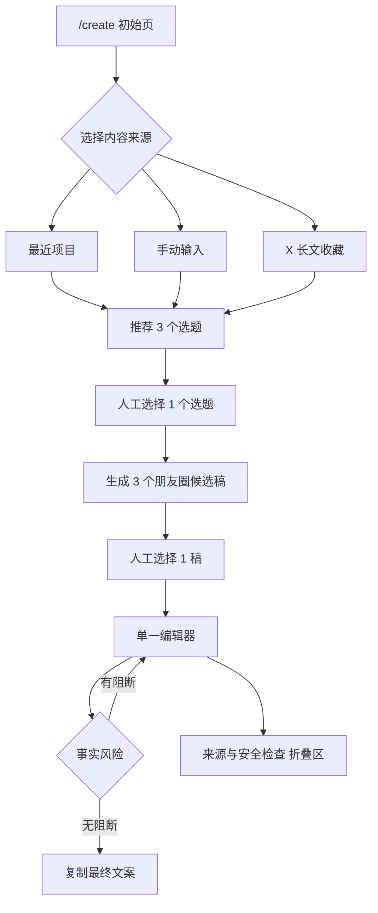

# 极简内容创作台 `/create` 产品线框与交互方案

日期：2026-07-14
状态：待齐鑫确认，design only
范围：只设计页面与交互，不写代码、不增加数据模型、不导入真实资料、不进入 Phase 6B

## 1. 产品决策

当前问题不是 Content OS 缺少能力，而是能力被 Project、SourceItem、EventCard、ContentAngle、EditorialDraft、Revision、PublicationPackage 等工程概念分散，用户无法从“我今天想发一条朋友圈”直接开始。

`/create` 应成为默认创作入口，把已有后端能力压缩为一条可理解的主线：

```text
选择来源 → 选择选题 → 选择候选稿 → 人工编辑 → 风险确认 → 复制
```

产品记忆点是“一张逐步展开的稿纸”，不是后台、数据看板或流程配置器。

### 成功标准

1. 用户第一次打开页面，能在 10 秒内知道从哪里开始。
2. 从选择来源到复制文案，主路径不离开 `/create`。
3. 页面同时只出现一个主操作，不要求理解数据库实体。
4. 最终文案始终经过人工编辑，系统不自动覆盖。
5. 事实风险可见但不淹没创作，技术追溯默认收起。
6. 透明工地不作为默认内容，只能由用户主动打开演示案例。

### 本阶段不做

- 不增加 Prisma 模型或 migration。
- 不增加扫描器、后台任务、队列、缓存或 AI Provider。
- 不批量导入 164 篇 X 收藏资料或 30 条 TopicCandidate。
- 不自动批准、不创建自动发布链路、不调用平台 API。
- 不把 `/create` 做成现有后台页面的导航集合。
- 不重做 `/editorial`、`/opportunities`、`/topics` 或 `/publication`。

## 2. 用户心智

页面只使用用户语言：

| 工程概念 | `/create` 中的用户语言 |
|---|---|
| Project / EventCard / SourceItem | 最近项目 / 这次发生的事 / 来源 |
| TopicCandidate / ContentAngle | 选题 |
| MasterContent / EditorialDraft | 候选稿 |
| human_edit Revision | 当前编辑稿 |
| StyleReview / factBoundary | 风险提示 |
| evidenceSnapshot / hash | 来源与安全检查 |
| PublicationPackage / Export | 不在主流程出现 |

页面不显示“模型已生成”“创建 Revision”“写入数据库”等实现语言。

## 3. 视觉方向

方向：**克制的单页编辑桌**。

- 白色页面、深灰正文，使用低饱和绿色表示完成，琥珀色表示需要确认，红色只用于阻断风险。
- 不使用渐变、装饰图形、营销式 Hero、悬浮大卡片或卡片套卡片。
- 主体最大宽度约 920px，编辑区保持适合中文长文阅读的 640–720px 行宽。
- 使用细分隔线建立节奏；容器圆角不超过 4px。
- 标题克制，主标题 28–32px；编辑器正文 16px、行高 1.8。
- 顶部步骤只表达位置，不显示后台完成百分比或复杂状态。
- 桌面与移动端均保持单列，不在窄屏强行做三栏。

## 4. 页面信息架构



页面由五个连续区段组成：

1. 来源
2. 选题
3. 候选稿
4. 编辑
5. 来源与安全检查

未到达的区段不渲染占位大框；已完成区段收成一行摘要，可点击返回修改。

## 5. 桌面线框

```text
┌────────────────────────────────────────────────────────────────────┐
│ 齐鑫 Content OS                                  [新建一篇]        │
│                                                                    │
│ 写一条朋友圈                                                       │
│ 来源 ───── 选题 ───── 草稿 ───── 编辑                              │
├────────────────────────────────────────────────────────────────────┤
│ 1 这次从哪里开始？                                                  │
│                                                                    │
│ [ 最近项目 ]  [ 手动输入 ]  [ X 长文收藏 ]                         │
│                                                                    │
│ ○ GEO Monitor       最近更新：7 月 13 日                            │
│ ○ AI 视频画布       最近更新：7 月 11 日                            │
│ ○ 晟景官网          最近更新：7 月 09 日                            │
│                                                                    │
│                                               [推荐选题 →]          │
│ 查看流程演示案例                                                    │
├────────────────────────────────────────────────────────────────────┤
│ 2 选一个今天值得说的角度                                            │
│                                                                    │
│ ◉ 我为什么重新整理这个项目                                         │
│   从一次真实变化进入，不先讲大道理                                  │
│ ────────────────────────────────────────────────────────────────── │
│ ○ 一个没做完但值得记录的判断                                       │
│   保留限制和证据缺口                                                │
│ ────────────────────────────────────────────────────────────────── │
│ ○ 这件事改变了我什么                                               │
│   从个人感受自然带出观点                                            │
│                                                                    │
│                                           [生成 3 个候选稿 →]        │
├────────────────────────────────────────────────────────────────────┤
│ 3 先挑一版接近你的                                                   │
│                                                                    │
│ [A 生活记录]   [B 项目复盘]   [C 克制观点]                          │
│ ────────────────────────────────────────────────────────────────── │
│ 最近……                                                             │
│                                                                    │
│ （当前候选全文，只读预览）                                         │
│                                                                    │
│                                                  [用这版继续 →]     │
├────────────────────────────────────────────────────────────────────┤
│ 4 改成你真正会发的样子                                              │
│                                                                    │
│ ┌────────────────────────────────────────────────────────────────┐ │
│ │ 单一正文编辑器                                                 │ │
│ │ Hook、正文、CTA 在用户视角中是一篇连续朋友圈文案               │ │
│ │                                                                │ │
│ │                                                                │ │
│ └────────────────────────────────────────────────────────────────┘ │
│                                                                    │
│ ⚠ 2 处需要确认：上线状态 · 客户结果                 [逐项查看]     │
│                                                                    │
│ ▸ 来源与安全检查                                                   │
│                                                                    │
│                                         [复制最终文案]              │
└────────────────────────────────────────────────────────────────────┘
```

说明：线框中的项目和选题是布局示例，不代表当前数据库一定存在。真实实现必须读取现有数据；没有数据时显示空状态，不生成假项目。

## 6. 移动端线框

```text
┌────────────────────────────┐
│ 写一条朋友圈        [新建] │
│ 来源 · 选题 · 草稿 · 编辑  │
├────────────────────────────┤
│ 1 这次从哪里开始？          │
│                            │
│ [最近项目][手动输入][X收藏]│
│                            │
│ ○ GEO Monitor             │
│   7 月 13 日               │
│ ○ AI 视频画布             │
│   7 月 11 日               │
│                            │
│          [推荐选题 →]      │
├────────────────────────────┤
│ 后续步骤按选择逐段出现      │
│ 候选稿使用横向标签切换      │
│ 编辑器占满可用宽度          │
├────────────────────────────┤
│ ⚠ 2 处需要确认             │
│ ▸ 来源与安全检查           │
│                            │
│ [复制最终文案]             │
└────────────────────────────┘
```

移动端底部主按钮可以保持在安全区上方，但不能遮挡正文、风险提示或折叠区。

## 7. 交互规则

### 7.1 初始状态

- 页面标题固定为“写一条朋友圈”。
- 默认不预选来源，也不自动推荐透明工地。
- 焦点落在来源分段控件。
- 只显示来源区和一个禁用的“推荐选题”按钮。
- 页面不显示历史 Draft、发布包、分数或数据库数量。

### 7.2 来源一：最近项目

显示最近有真实 EventCard 或可追溯 SourceItem 的项目，最多 5 个：

- 项目名
- 最近一次可用事件的日期
- 一句发生了什么

不显示项目 ID、事件状态、素材数量和评分。

排序：按最近一次可用真实事件时间倒序。若项目只有计划、没有可核验事件，不进入默认列表。

“透明工地资料整理”只出现在“查看流程演示案例”展开区，带固定标签“流程演示”。它不占最近项目位置、不预选、不作为推荐选题的首页默认输入。

### 7.3 来源二：手动输入

主输入框文案：

```text
写下这次真实发生的事。可以包括做了什么、遇到什么、结果和你的感受。
```

用户先看到一个自然语言输入框，不先面对 EventCard 的七个字段。提交后使用现有事实检查能力识别缺口，只追问缺少的项目：

- 现在能确认的结果是什么？
- 你的真实感受是什么？
- 有什么可以核对的依据？

结果、个人感受或依据缺失时，不进入选题推荐。补充内容应转换为现有 manual SourceItem / EventCard 输入，不增加临时数据模型。

### 7.4 来源三：X 长文收藏

正式定位固定为：

> X 长文收藏研究库——以 X 收藏长文为主、持续更新的动态外部研究资料源。

只显示经过人工 shortlist、来源未隔离且仍有效的 TopicCandidate。每条只显示标题、核心角度和来源数量，不显示 evidenceStrength 分数。

当前真实 TopicCandidate 为 0，首版应显示真实空状态：

```text
还没有通过人工筛选的 X 收藏选题。
```

不读取仓库外私有 manifest 伪装成正式数据，不自动导入 30 条候选，不提供“立即扫描”或“批量导入”入口。

外部资料只提供研究角度，不得直接作为齐鑫的个人经历或已验证事实。选中后如缺少齐鑫的一手经历，系统应先要求补一句“这和我有什么关系”，再允许生成候选稿。

### 7.5 推荐 3 个选题

推荐结果固定为 3 条，使用单选列表，不做三张彩色卡片。每条包含：

- 选题标题，最多 24 个中文字符。
- 一句推荐理由，最多 36 个中文字符。
- 可选的一条事实限制，例如“只谈文档整理，不写上线结果”。

不显示五项 ContentScore、总分、recommendation 枚举、平台列表或模型解释。

推荐必须来自现有 ContentAngle / TopicCandidate / EventCard 事实，不补充新成果。少于 3 个可信角度时，宁可显示 1–2 条并说明“当前资料只支持这些角度”，不能用空话凑满。

更换来源时，如果已生成下游内容，先确认：

```text
更换来源会清空当前选题和草稿。
```

确认后只清理本页下游状态，不删除已有数据库记录。

### 7.6 生成 3 个朋友圈候选稿

三稿固定围绕同一事实边界，但表达入口不同：

- A 生活记录：先说最近发生的具体事情。
- B 项目复盘：强调过程、问题和当前结果。
- C 克制观点：从经历中自然出现一个判断。

这是默认标签，不要求每次机械生成同样句式。候选稿通过标签切换，同一时间只显示一稿全文，避免三栏比较造成阅读负担。

候选稿是建议，不覆盖现有 MasterContent 或人工 Revision。只有用户点击“用这版继续”后，所选文本才进入单一编辑器。A/B/C 和当前编辑文本保存在浏览器会话状态中，不持久化为新模型，也不暗中创建 Revision。

生成中保留页面结构，显示行内进度“正在整理 3 个版本…”，不使用全屏 loading。

### 7.7 单一编辑器

用户只看到一篇连续的朋友圈正文，不分别编辑 Hook、body、CTA。内部标题由选题生成，用于 Content OS 索引，放入折叠区，不冒充朋友圈原始标题。

编辑器规则：

- 选择候选稿后自动聚焦正文，但不自动保存或批准。
- 用户输入后，系统建议不得直接改写正文。
- 切换回候选稿时，如已有人工修改，必须确认是否放弃当前编辑。
- Hook 和 CTA 允许为空，不显示必填提示。
- 复制内容仅包含当前编辑器正文，不包含内部标题、风险、来源或检查项。
- 候选稿进入编辑器时，Hook、body、CTA 按空行组合为一篇连续文本；首版不反向猜测分段。
- 页面用 sessionStorage 恢复当前来源、选题、候选和人工文本，刷新或同一标签页返回时不丢失。
- “复制最终文案”只写剪贴板，不创建 Draft、Revision、VoiceSample、PublicationPackage 或 Export。

首版不提供富文本工具栏、Emoji 选择器、自动配图或平台切换。

### 7.8 少量事实风险提示

主界面最多显示 3 条高价值提示，使用短句：

- “上线状态需要确认”
- “客户结果没有来源”
- “这句话把计划写成了完成”

风险分两级：

| 级别 | 行为 |
|---|---|
| 阻断 | 未证实成果、把计划写成完成、把外部观点写成本人经历；复制按钮禁用，定位到对应句子 |
| 提醒 | 表达绝对、来源较旧、个人判断缺少限定；允许复制，但保留提示 |

不在主界面显示 overallScore、authenticityScore、aiToneScore 或完整 StyleReview。风险消除后提示行变成“未发现明显事实风险”，不使用庆祝动画。

## 8. “来源与安全检查”折叠区

默认收起。展开后分三层，仍不使用嵌套卡片：

### 用户可读信息

- 来源名称和标题
- 来源日期或最近更新时间
- 已确认事实
- 尚缺证据
- 不应出现的声明
- 外部资料提示与版权提醒

### 完整检查

- 详细事实风险
- StyleReview 问题与建议
- 完整人工检查单
- 当前内部标题

### 技术详情

- SourceItem ID
- EventCard ID
- Revision ID
- evidenceSnapshot
- source/content hash
- packageHash
- PublicationExport 记录

技术详情使用二次展开“查看技术追溯”，避免用户第一次打开安全区就看到 ID 墙。绝对路径、密钥、Cookie、完整私人来源正文在任何层都不得显示。

## 9. 现有后端能力映射

本设计不要求新增基础设施：

| 页面动作 | 优先复用能力 | 设计约束 |
|---|---|---|
| 最近项目 | Project、EventCard、SourceItem 查询 | 只选有真实事件和来源的项目 |
| 手动输入 | manual SourceItem、EventCard generator、fact-check | 缺结果/感受/依据时先补齐 |
| X 长文收藏 | shortlisted TopicCandidate + 安全 SourceItem 摘要 | 当前为 0，显示空状态；不导入 manifest |
| 3 个选题 | ContentAngle、ContentScore、TopicCandidate | 分数隐藏；少于 3 个不凑数 |
| 3 个候选稿 | content generator、VoiceProfile、7 条 VoiceSample | 只生成朋友圈；不复制样本原句 |
| 人工编辑 | 页面会话状态；现有 EditorialDraft 仅可作为输入 | 首版不暗中创建 Revision，不覆盖已有人工稿 |
| 风险提示 | fact-check、StyleReview、factBoundary | 主界面最多 3 条，其余折叠 |
| 复制 | 当前编辑器文本 | 不要求 PublicationPackage/Export 才能复制 |

### 关键实现边界

1. `/create` 是现有能力的编排层，不是新的内容实体。
2. 候选 A/B/C 和当前人工编辑稿是浏览器会话状态；首版复制流程不要求进入 Draft/Revision。
3. 复制不是发布，不更新 PublicationPackage 为 published。
4. 如现有服务无法在不修改模型的前提下完成某一步，应先回到产品确认，不以新增表解决交互问题。

## 10. 页面状态与错误处理

| 状态 | 页面反馈 | 下一步 |
|---|---|---|
| 无最近项目 | “还没有可用于创作的真实项目记录” | 切换手动输入 |
| X 收藏为空 | “还没有通过人工筛选的 X 收藏选题” | 切换其他来源 |
| 手动输入缺字段 | 只追问缺少的结果/感受/依据 | 补齐后推荐 |
| 选题不足 3 个 | 显示现有可信选题，不补空话 | 选择其中一个或换来源 |
| 生成失败 | 保留来源和选题，“候选稿生成失败，请重试” | 重试生成 |
| 有阻断风险 | 高亮对应句子，复制禁用 | 人工修改 |
| 复制成功 | “已复制，未自动发布” | 用户自行发布 |
| 用户返回上游 | 确认是否清空本页下游状态 | 确认或取消 |

错误信息不得输出模型栈、数据库错误、绝对路径或 SourceItem ID。

## 11. 主界面文案

建议固定文案：

| 位置 | 文案 |
|---|---|
| 页面标题 | 写一条朋友圈 |
| 来源问题 | 这次从哪里开始？ |
| 选题标题 | 选一个今天值得说的角度 |
| 候选标题 | 先挑一版接近你的 |
| 编辑标题 | 改成你真正会发的样子 |
| 生成按钮 | 生成 3 个候选稿 |
| 采用按钮 | 用这版继续 |
| 复制按钮 | 复制最终文案 |
| 复制成功 | 已复制，未自动发布 |
| 折叠区 | 来源与安全检查 |
| 演示入口 | 查看流程演示案例 |
| 透明工地标签 | 流程演示 |

不出现“赋能、智能创作、一键爆款、AI 帮你写、立即发布”等营销或误导文案。

## 12. 无障碍与响应式要求

- 三种来源使用可键盘操作的 segmented control，并有明确选中状态。
- 选题使用原生 radio 语义，候选稿使用 tabs 语义。
- 风险不能只靠颜色区分，必须有图标、文字和级别。
- 编辑器有稳定最小高度，加载、风险和字数变化不能导致页面跳动。
- 所有按钮文本在 320px 宽度下不截断。
- 移动端主按钮占一行；桌面端靠右，不使用悬浮圆形按钮。
- 折叠区使用原生 disclosure 语义，默认收起但可键盘展开。

## 13. 产品验收标准

设计确认后，后续实现必须满足：

1. `/create` 首屏不显示任何技术 ID、hash、评分或发布记录。
2. 初始页不预选透明工地，也不自动出现透明工地选题。
3. 透明工地只能从“查看流程演示案例”主动进入，并始终显示“流程演示”。
4. 三种来源均有真实空状态，不用 mock 数据伪装可用。
5. 推荐区最多 3 条，不显示详细评分。
6. 候选稿同一时间只显示一篇，用户明确选择后才进入编辑器。
7. 页面只有一个正文编辑器，AI 建议不自动覆盖人工修改。
8. 主界面最多显示 3 条事实风险，其余信息放入折叠区。
9. 阻断风险未解决时不能复制；普通提醒不阻断。
10. 复制结果只含最终朋友圈正文，并提示“未自动发布”。
11. 刷新或同一标签页返回时从 sessionStorage 恢复；更换来源前明确确认，不静默丢失人工编辑。
12. 不新增 Prisma 模型，不导入真实 X 收藏资料，不创建自动发布能力。

## 14. 确认后再进入的实现顺序

本文件通过人工确认后，代码实现应严格按以下顺序，每一步单独验收：

1. `/create` 静态骨架、来源切换和所有空状态。
2. 最近项目读取与演示案例隔离。
3. 手动输入和现有 fact-check 补充流程。
4. 现有角度压缩为 3 个用户可读选题。
5. 三稿临时状态与单一编辑器。
6. 风险提示、折叠追溯和复制。
7. 桌面/移动端 Playwright 验收。

以上不构成开始写代码的授权。当前只提交线框和交互方案，等待齐鑫确认。
